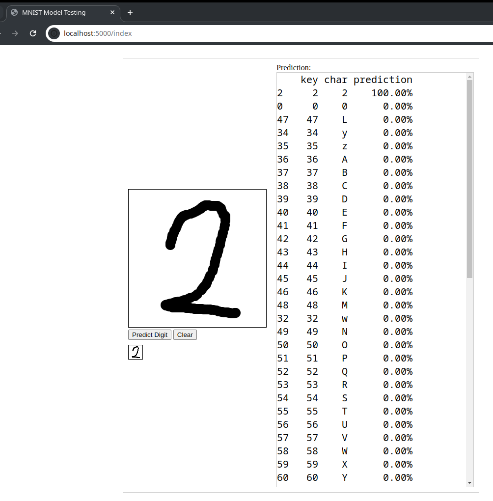

# Book Archiver - detecting hand written digits and letters from images

## Setting up the python virtual environment
To set up the python virtual environment run the following command:

```
bash setup-env.sh
```

the script will also install all the required libraries inside the virtual environment
<br>
use the virtual environment with:

```
source p3env/bin/activate
```

## Download the EMNIST dataset
run the following command to download the EMNIST dataset 
```
bash dldataset.sh
```
after the command finishes you should have the gzip.zip file in the datasets folder
<br>
the script will also extract the zip file
<br>
if the script fails consider downloading the dataset manually:
- https://www.nist.gov/itl/products-and-services/emnist-dataset
- https://biometrics.nist.gov/cs_links/EMNIST/Readme.txt
- https://biometrics.nist.gov/cs_links/EMNIST/gzip.zip

## Analyse the downloaded set
```
python dataset_analysis.py
```


## Training the convolutional neural network

```
python train_load_all.py
```

## Testing the convolutional neural network

Test the trained network with
```
python draw.py
```
this will run a flask server web page on 
http://localhost:5000/index
that will allow you to draw characters and test the accuracy of the convolutional neural network

