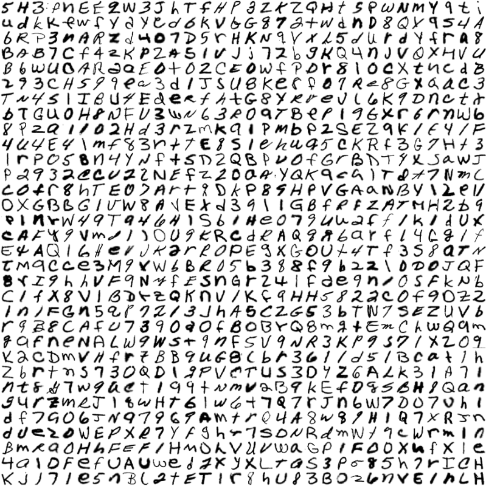
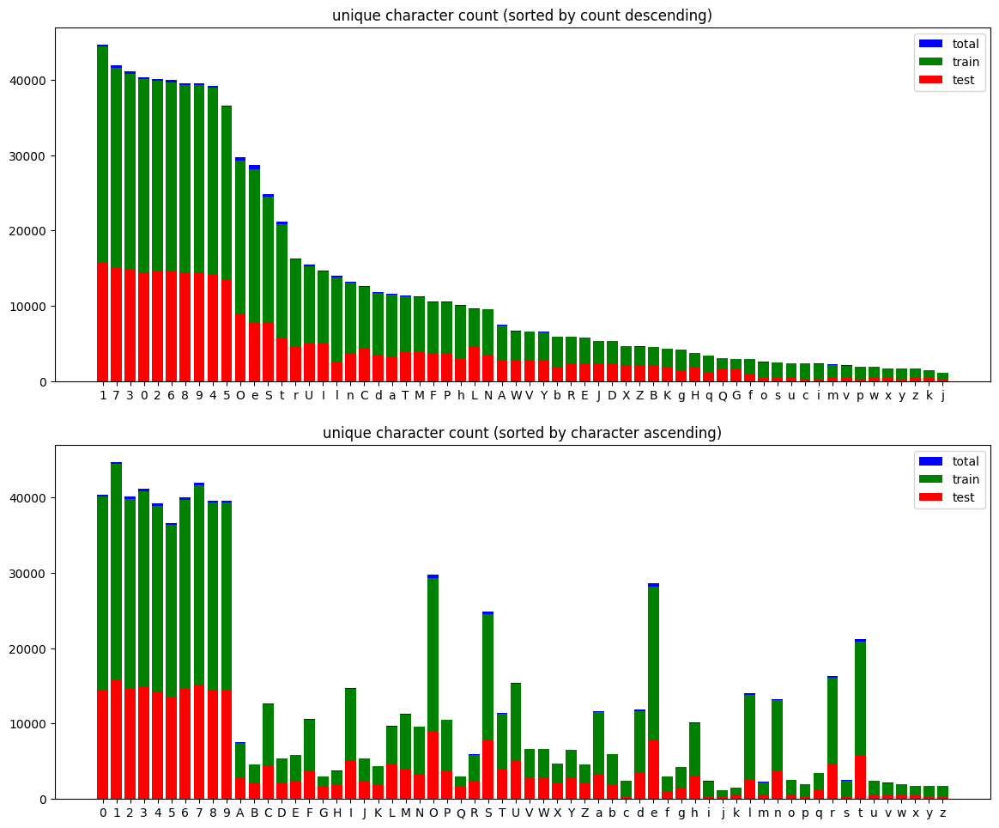
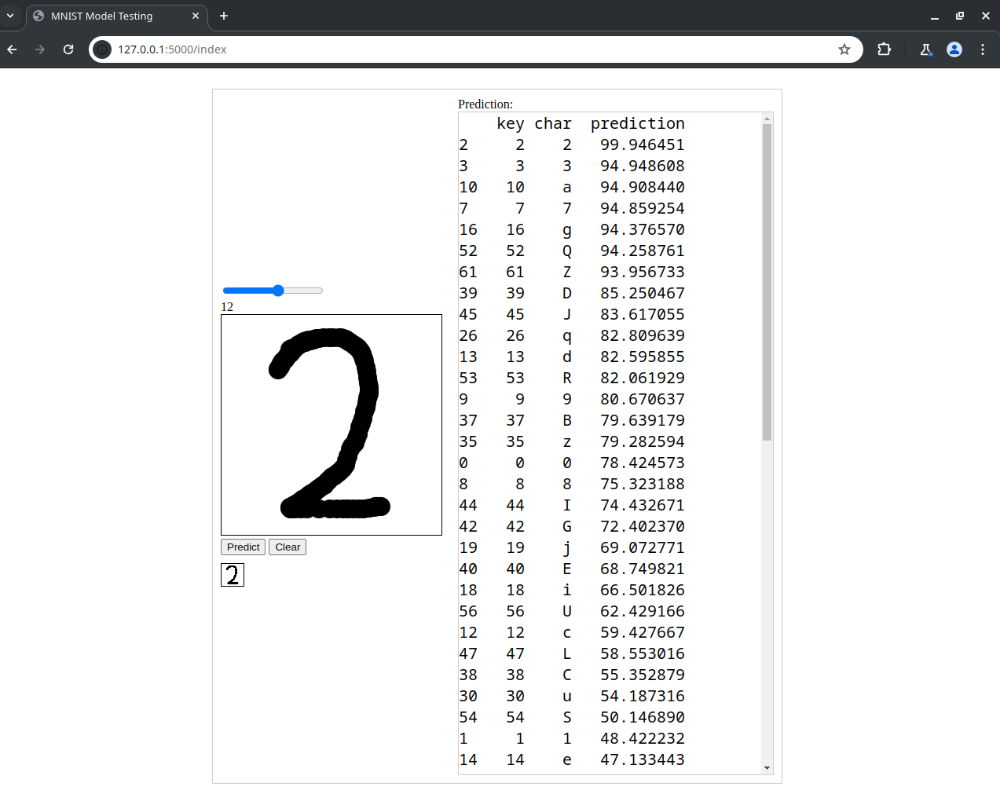
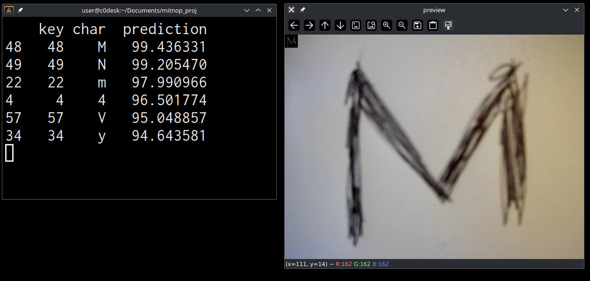

# Book Archiver - detecting hand written digits and letters from images

## Setting up the python virtual environment
To set up the python virtual environment run the following command:

```
./setup-env.sh
```

the script will also install all the required libraries inside the virtual environment

## Download the EMNIST dataset
run the following command to download the EMNIST dataset 
```
./dldataset.sh
```
after the command finishes you should have the gzip.zip file in the datasets folder
<br>
the script will also extract the zip file
<br>
if the script fails consider downloading the dataset manually:
- https://www.nist.gov/itl/products-and-services/emnist-dataset
- https://biometrics.nist.gov/cs_links/EMNIST/Readme.txt
- https://biometrics.nist.gov/cs_links/EMNIST/gzip.zip



## Analyse the downloaded set
```
./dataset_analysis.sh
```


## Training the convolutional neural network
run the following command if you want to train the network on the entire EMNIST set (train+test)
```
./train.sh
```

run the following commands if you want to train the network on 80% of the set
and test on the remaining 20%
```sh
./proper_train_test_split.sh
./train_80.sh
./test_20.sh # use this to test
```

## Testing the convolutional neural network - drawing input

Test the trained network with
```
./test_draw.sh
```
this will run a flask server web page on 
http://localhost:5000/index
that will allow you to draw characters and test the accuracy of the convolutional neural network



## Testing the convolutional neural network - camera input

```
./test_camera.sh
```


