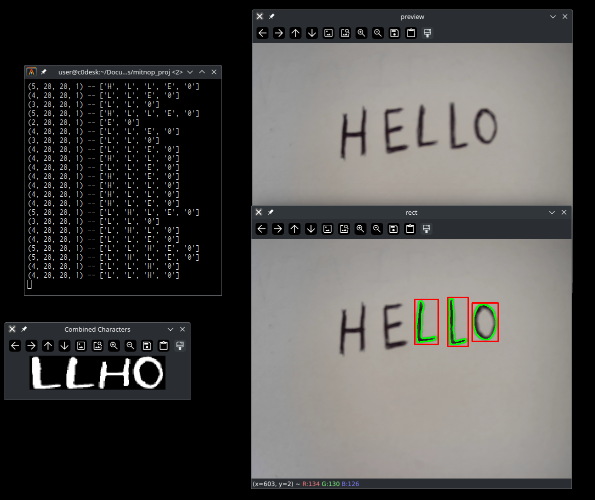

# Book Archiver - Препознавање ручно написаног текста (бројеви и слова)

тестирано на: Arch Linux

## Подешавање python виртуелног окружења
Да бисте подесили python виртуелно окружење покрените следећу команду:

```
./setup-env.sh
```

скрипта ће такође инсталирати све потребне библиотеке унутар виртуелног окружења

## Преузимање EMNIST скупа података
покрените следећу команду да бисте преузели EMNIST скуп података 
```
./dldataset.sh
```
након завршетка команде требало би да имате gzip.zip датотеку у datasets директоријуму
<br>
скрипта ће такође распаковати zip датотеку
<br>
ако скрипта не успе размотрите ручно преузимање скупа података:
- https://www.nist.gov/itl/products-and-services/emnist-dataset
- https://biometrics.nist.gov/cs_links/EMNIST/Readme.txt
- https://biometrics.nist.gov/cs_links/EMNIST/gzip.zip


## Анализа преузетог скупа
```sh
./dataset_analysis.sh       # графички приказ број слика карактера - излаз: stats директоријум
./dataset_checkdupes.sh     # провера дупликата
./dataset_grid.sh           # прављење грида са неким сликама - излаз: stats директоријум
```


## Тренирање конволуционе неуронске мреже
покрените следећу команду ако желите да тренирате мрежу на целом EMNIST скупу (тренинг+тест)
```
./train.sh
```

покрените следеће команде ако желите да тренирате мрежу на 80% скупа
и тестирате на преосталих 20%
```sh
./proper_train_test_split.sh
./train_80p.sh
./test_20p.sh
```

## Тестирање конволуционе неуронске мреже - унос цртањем

Тестирајте тренирану мрежу са
```
./test_draw.sh
```
ова команда ће покренути веб страницу flask сервера на
http://localhost:5000/index
што ће вам омогућити да цртате знакове и тестирате тачност конволуционе неуронске мреже


## Тестирање конволуционе неуронске мреже - унос преко камере

откривање појединачног карактера
```
./test_camera.sh
```


откривање више карактера, новија верзија (потребно довршити)
```
./test_camera2.sh
```

